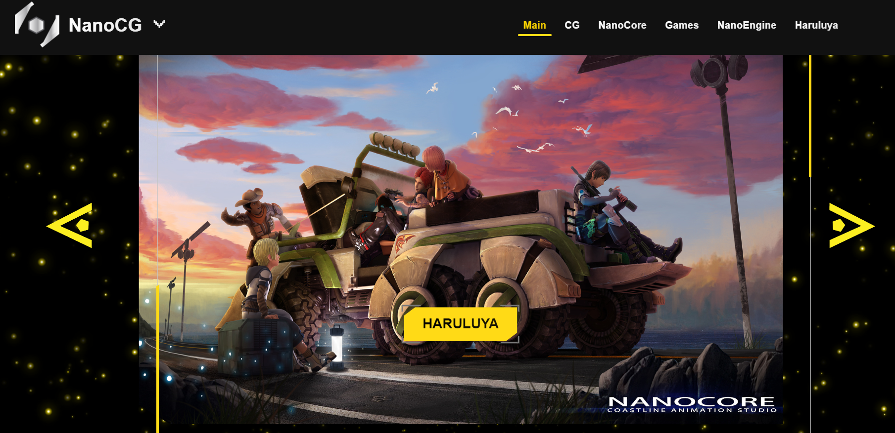
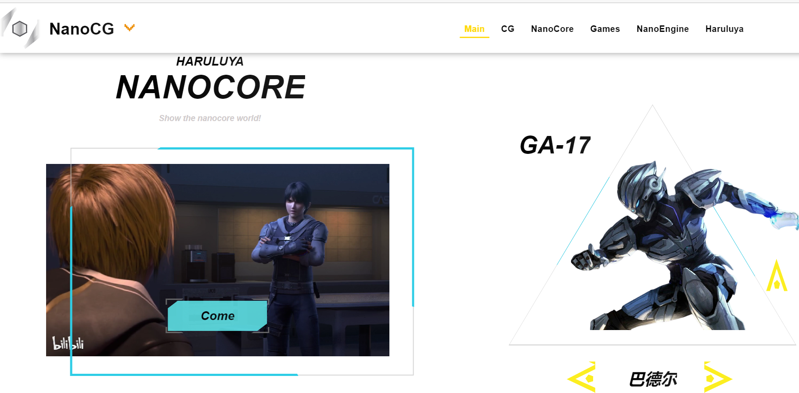
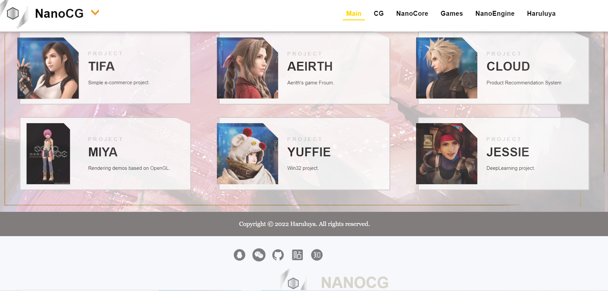
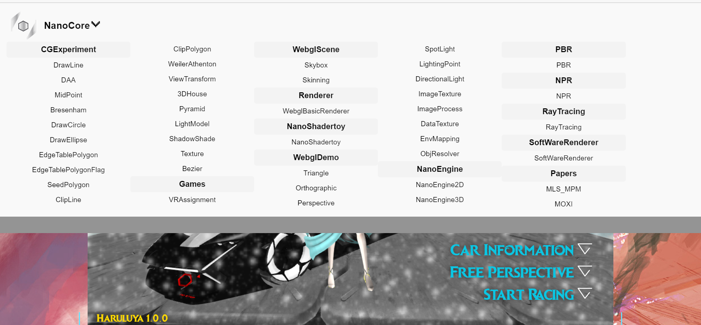
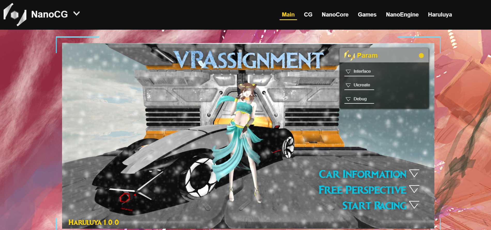
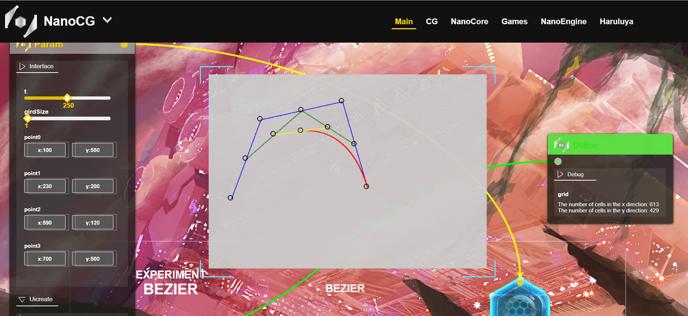

# Rock-Sugar
Personal website to show demos in CG and webgl.

### Introduction 


**Location:**

https://haruluya.github.io/Rock-sugar

### Name

**Rock-sugar**

The protagonist in the "nano-core".


### Usage

```shell
git clone https://github.com/Haruluya/Rock-sugar.git
```

### Presentation

**2022/11-**

**Main**









**EX**




**Webgl**



**Experiment**




### Contact Author 

### License

MIT


