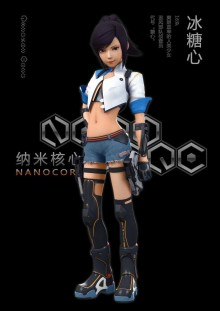

# Rock-Sugar
My personal website to show demos in webgl.

### Introduction 


### Name

**Rock-sugar**



**冰绥新**是在动画《纳米核心》中登场的虚拟人物，女主角，代号“糖心”。

### Usage

```shell
git clone https://github.com/Haruluya/Rock-sugar.git
```

### Presentation

### Contact Author 

### License

MIT


